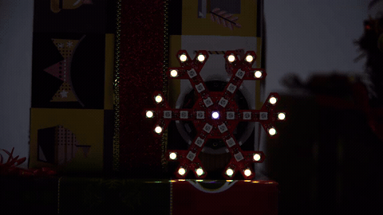

# STC15W204S RGB LED Snowflake

A programmable RGB LED snowflake board based on the **STC15W204S** 8051-compatible microcontroller and **WS2812B addressable RGB LEDs**.

The board combines a microcontroller, USB-to-serial interface, RGB LED array, and supporting circuitry on a snowflake-shaped PCB. It can be used for learning embedded C programming, experimenting with addressable LEDs, developing lighting effects, or building programmable decorations.



## Features

* STC15W204S 8051-compatible microcontroller
* WS2812B addressable RGB LEDs
* Individually controllable LED color and brightness
* Micro-USB power and communication
* CH340-family USB-to-serial interface
* Onboard pushbutton
* Programmable LED animations
* Snowflake-shaped PCB
* Firmware written in C

Example lighting effects include:

* Pixel chase
* Inside-to-outside animations
* Ring and flower effects
* Gradual color transitions
* Breathing effects
* Multicolor animations

## Hardware Overview

| Component            | Description                |
| -------------------- | -------------------------- |
| MCU                  | STC15W204S                 |
| Architecture         | 8051-compatible, 1T        |
| Flash                | 4 KB                       |
| RGB LEDs             | WS2812B-compatible         |
| LED interface        | Single-wire, 800 kbit/s    |
| Color format         | 24-bit GRB                 |
| USB interface        | CH340-family USB-to-serial |
| Connector            | Micro-USB                  |
| Programming language | C                          |

The board is designed as a dedicated RGB LED controller rather than a general-purpose MCU development board.

## Getting Started

### 1. Connect the Board

Connect the board to a computer or USB power source using a Micro-USB cable.

For programming or serial communication, use a cable that supports USB data. Some Micro-USB cables provide power only.

If firmware is already installed, the board should begin running its programmed LED animation after power is applied.

### 2. Clone the Repository

```bash
git clone https://github.com/novasteptech/stc15w204-led-snowflake.git
cd stc15w204-led-snowflake
```

### 3. Development Environment

The firmware for this board is written in C for the STC15W204S family.

Typical development requires:

* An 8051-compatible C compiler or IDE
* An STC-compatible programming utility
* A CH340-compatible USB serial driver when required by the operating system

WS2812B communication is timing-sensitive, so MCU clock and compiler settings should be checked when modifying or rebuilding the LED driver.

## WS2812B LED Interface

The RGB LEDs are connected as a serial chain and controlled through a single data signal.

Each LED receives 24 bits of color data in **GRB** order:

```text
GGGGGGGG RRRRRRRR BBBBBBBB
```

The LEDs operate at a nominal data rate of **800 kbit/s**.

Each LED consumes its own 24-bit color value and forwards the remaining data to the next LED in the chain.

This allows every LED on the snowflake to be controlled individually.

## Firmware

The reference firmware implements several RGB animation patterns, including:

* Full-board effects
* Pixel chase
* Inside-to-outside animations
* Ring animations
* Flower-style animations
* Gradual color transitions
* Breathing effects
* Multicolor patterns

Because WS2812B LEDs use a timing-sensitive protocol, changes to the MCU clock or compiler optimization may affect LED communication.

## Repository Structure

```text
.
├── docs/       Documentation and reference material
├── images/     Images and documentation assets
├── README.md
└── demo GIFs
```

Additional firmware and hardware design resources may be added as they are prepared for release.

## Troubleshooting

### Board does not light up

Check:

* Micro-USB cable
* USB power source
* USB connector
* Visible soldering defects

Try another known-good USB cable if necessary.

If the board becomes unusually hot, disconnect power immediately.

### No serial device appears

Make sure the USB cable supports data.

Also try:

* Another USB port
* Connecting directly instead of through an unpowered USB hub
* Checking the operating system's device manager
* Installing the appropriate CH340 driver if required

### Only some LEDs work

WS2812B LEDs are connected in a serial chain. A failed LED or connection can prevent downstream LEDs from receiving data.

Inspect the connection between the last working LED and the first non-working LED.

### Colors are incorrect

Make sure the firmware sends color data in **GRB** order rather than conventional RGB order.

Also check the WS2812B timing if colors flicker or behave unpredictably.

## Documentation

Additional reference material is available in the [`docs`](docs/) directory.

## Applications

This board is suitable for:

* Embedded C programming practice
* 8051 MCU experiments
* WS2812B protocol experiments
* RGB animation development
* LED timing experiments
* Decorative lighting projects
* Electronics education

## Contributing

Issues and pull requests are welcome.

If you find an error in the documentation or have an improvement to suggest, please open an issue.

---

Developed by [NovaStep Tech](https://github.com/novasteptech).
